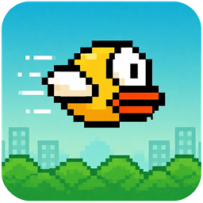
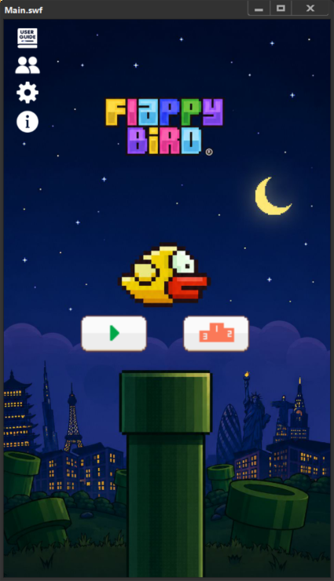
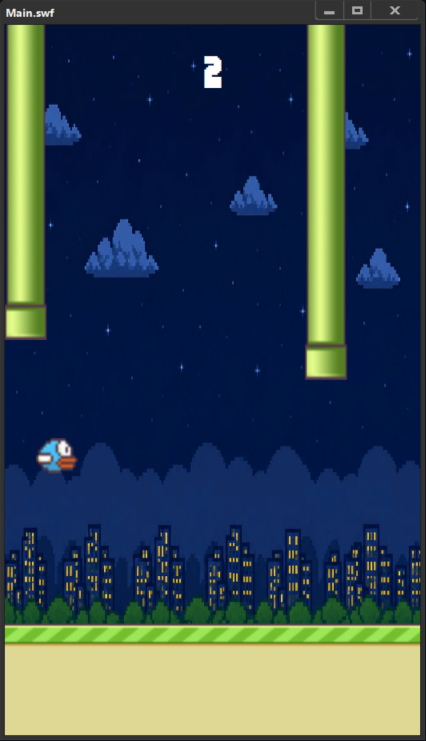
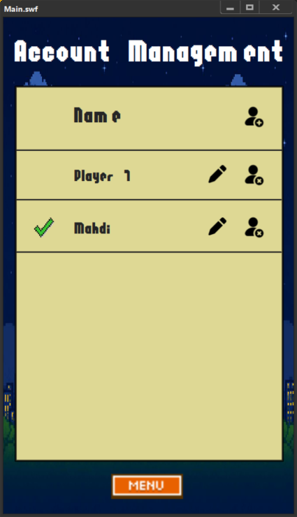
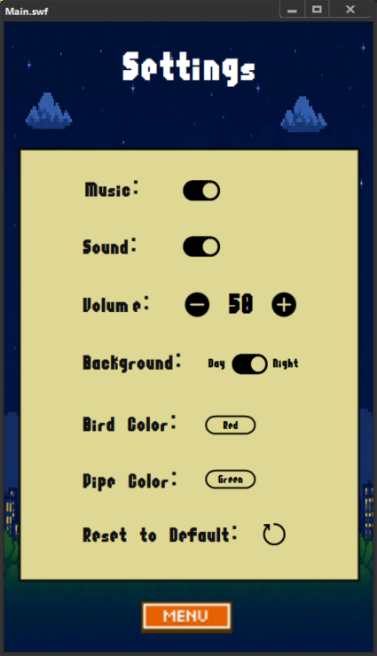
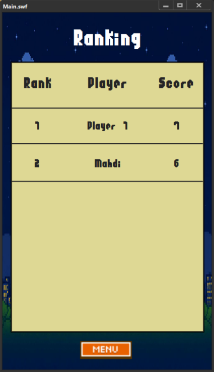
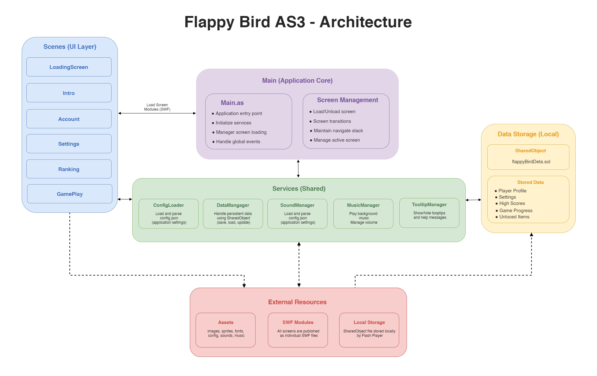

<p align="center">
  
</p>

<h1 align="center">Flappy Bird AS3</h1>

<p align="center">
  A modular Flappy Bird clone built with ActionScript 3 and Adobe Animate.
</p>

<p align="center">
  
  
  
</p>

---

## Demo

Gameplay Video

<p align="center">
  <video width="850" controls>
    <source src="docs/video/flappy-bird-demo.mp4"type="video/mp4">
    Your browser does not support the video tag.
  </video>
</p>

## Screenshots

Screenshots

<p align="center">
  
  
  
  
  
</p>

---

## Features

- Classic Flappy Bird gameplay
- Modular screen architecture
- Local player profiles
- Leaderboard and high score tracking
- Persistent storage using SharedObject
- Sound and music management
- Theme customization
- Screen-based navigation system

---

## Project Structure

```text
├── assets/
├── data/
├── docs/
├── fla/
├── src/
└── swf/
```
---

## Architecture

The application follows a modular screen-based architecture.

```text
Main
 └── LoadingScreen
      └── Intro
           ├── Account
           ├── Settings
           ├── Ranking
```
Each screen is published as an individual SWF and loaded dynamically at runtime.

<p align="center">
  
</p>


---

## Requirements

- Adobe Animate CC (or compatible version)
- ActionScript 3

---

## First Build

Before running the project for the first time, all screen modules must be published.

Run:

```text
publish-modules.jsfl
```

This script publishes all module FLA files and generates the required SWF files inside:

```text
swf/
```

Generated files:

```text
LoadingScreen.swf
Intro.swf
Account.swf
Settings.swf
Ranking.swf
GamePlay.swf
```

---

## Running the Project

After all modules have been published once, you can start the application using one of the following methods:

### Option 1

Run:

```text
run-main.jsfl
```

### Option 2

Open:

```text
Main.fla
```

and publish it manually from Adobe Animate.

Common shortcut:

```text
Alt + Enter
```

or use the standard Publish command from the Animate menu.

---

## Data Storage

Player profiles, settings, scores, and other persistent data are stored locally using Flash SharedObject.

On Windows, the saved data can typically be found under:

```text
C:\Users\<USERNAME>\AppData\Roaming\Macromedia\Flash Player\#SharedObjects\<RANDOM_ID>\localhost\
```

The main save file is:

```text
flappyBirdData.sol
```

### Reset Saved Data

If you want to remove all saved profiles, settings, and scores, close the application and delete the `flappyBirdData.sol` file.

The next time the game starts, a new save file will be created automatically with the default configuration.

## License

This project is licensed under the [MIT License](/LICENSE).

---